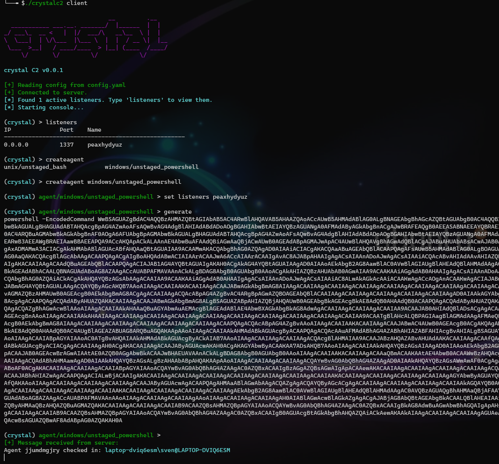
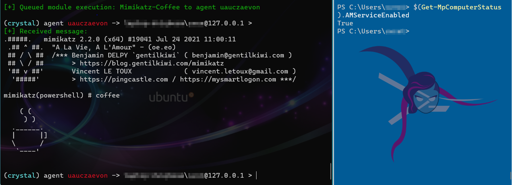

### CrystalC2

Currently learning more about read teaming and how C2 servers generally work, I wanted to write my own, so here we go.
Right now only features basic listeners and agents and post exploitation modules with AMSI bypass.

Be aware that Windows Defender will disallow you cloning this repo because of the inclusion of tools like mimikatz as post-eploitation modules.

#### Usage

```bash
./crystalc2 server
./crystalc2 client
```

Type `help` or `help <command>` to view the console documentation.

#### Agents and listeners


#### Modules with AMSI bypassing


