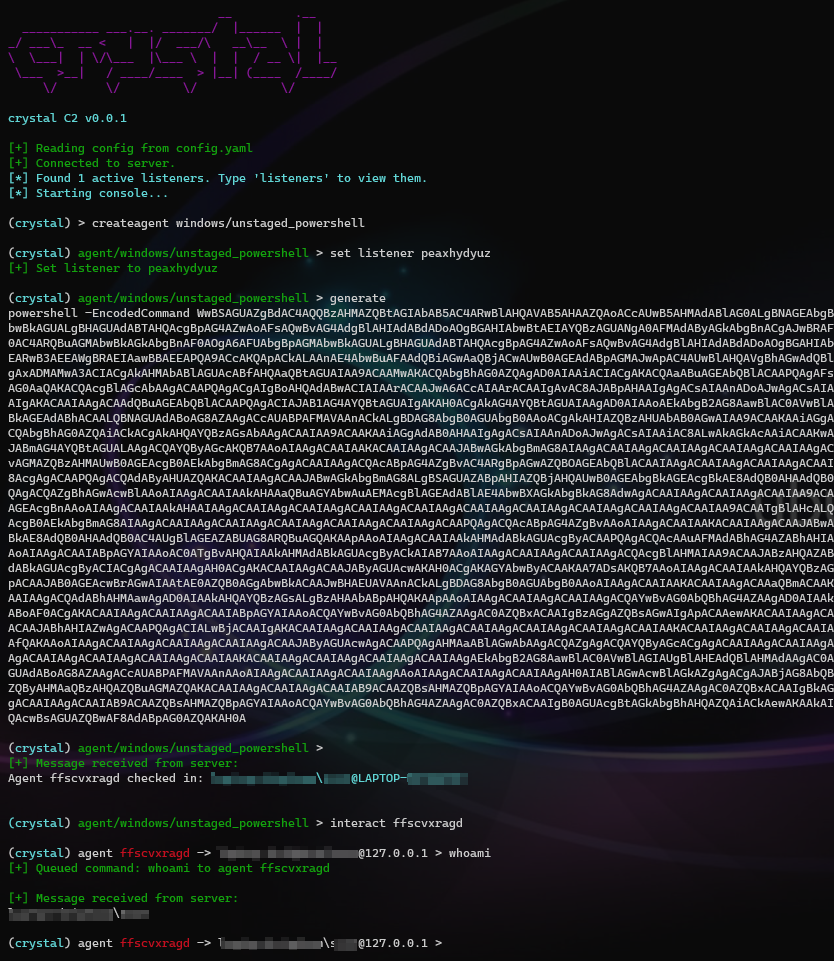

### CrystalC2

Currently learning more about read teaming and how C2 servers generally work, I wanted to write my own, so here we go.
Right now only features basic listeners and agents and a bad amsi bypass.

Be aware that windows defender will disallow you cloning this repo because of the inclusion of tools like mimikatz as post-eploitation modules.

#### Usage

```bash
./crystalc2 server
./crystalc2 client
```


